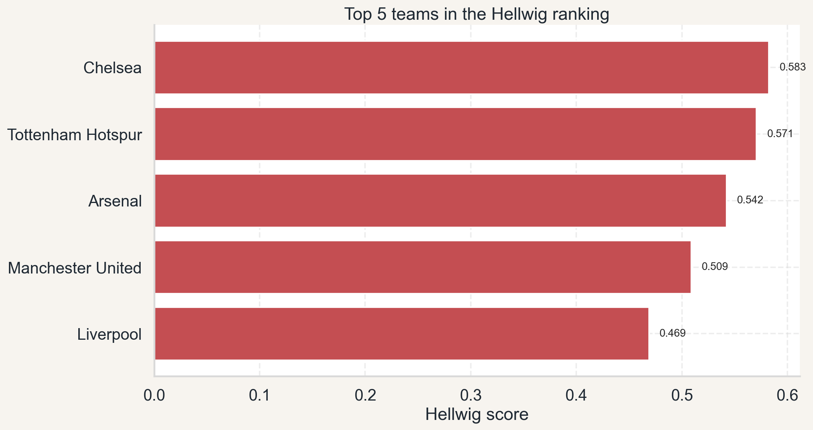
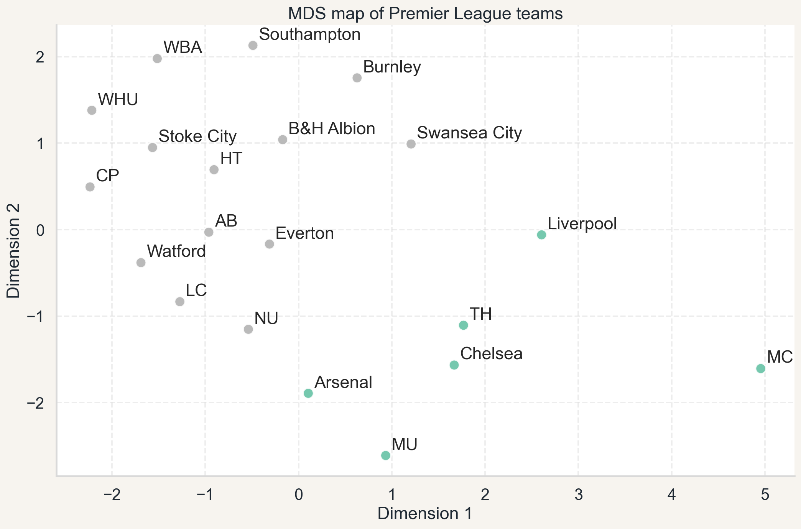
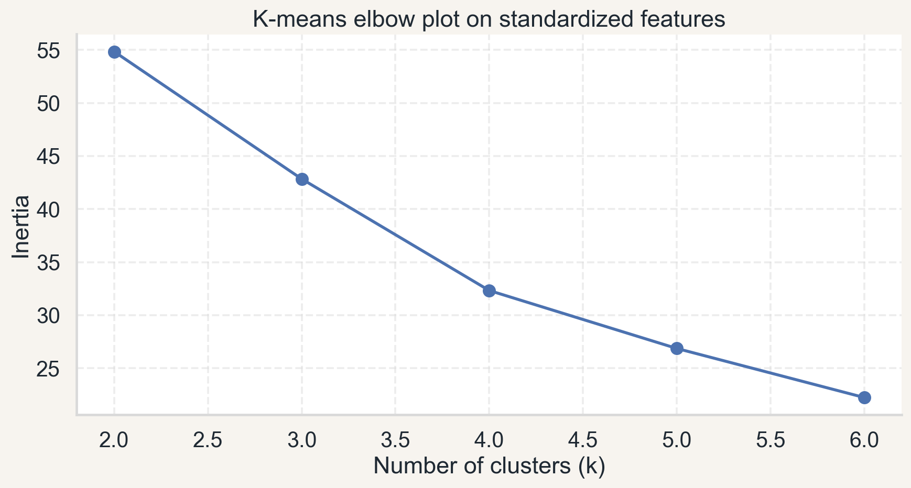

# Premier League Style Analysis

Which Premier League team played the most attractive football in the 2017/2018 season?

This project turns that subjective question into a compact data analysis case study. The notebook combines multicriteria ranking methods with clustering to compare Premier League clubs through attacking output, defensive record, discipline, and style of play.

## At A Glance

- 20 teams from the 2017/2018 Premier League season
- 5 final ranking features after feature selection
- 2 ranking methods compared side by side
- 3 unsupervised views of team similarity: K-means, hierarchical clustering, and MDS

## Why This Project Works In A Portfolio

This repository is not just a football notebook. It shows how to:

- turn a vague question into a measurable analytical problem,
- build a small but reproducible ranking pipeline,
- compare conclusions across two synthetic measures,
- support the ranking with clustering and 2D projection.

## Key Questions

- Which team ranks highest when "attractive football" is defined through the selected indicators?
- Do Hellwig and standardized sums lead to similar conclusions?
- Do the clubs form broader profile-based groups beyond a simple league table?

## Main Findings

- Chelsea finishes first in both ranking methods after the refreshed workflow.
- The two rankings are highly consistent, with Spearman rank correlation of 0.938.
- Tottenham Hotspur, Arsenal, Manchester United, Liverpool, and Manchester City stay near the top, even when the exact ordering changes.
- Standardized clustering separates the traditional Big 6 from the rest of the league.

## Visual Summary

### Top 5 in the Hellwig ranking



### Cluster structure in two dimensions



### K-means elbow plot



## Final Ranking Snapshot

| Rank | Team | Hellwig score |
| --- | --- | ---: |
| 1 | Chelsea | 0.583 |
| 2 | Tottenham Hotspur | 0.571 |
| 3 | Arsenal | 0.542 |
| 4 | Manchester United | 0.509 |
| 5 | Liverpool | 0.469 |

## Data

Source: Kaggle Premier League dataset.

Final variables used in ranking and clustering:

- Goals scored (`G+`)
- Goals conceded (`G-`)
- Yellow cards (`YC`)
- Draws (`D`)
- Backward passes per touch (`BPPT`)

Red cards were kept in the exploratory stage, then removed from the final synthetic measures to keep the model simpler and easier to interpret.

## Methods

The notebook includes:

- data cleaning and feature engineering,
- stimulant and destimulant transformation,
- standardization with `StandardScaler`,
- Hellwig linear ordering method,
- standardized sums method,
- rank comparison using Spearman correlation,
- K-means clustering,
- hierarchical clustering with Ward linkage,
- MDS projection for visualization.

## Repository Structure

- `premier-league-style-analysis.ipynb` - main notebook with the full analysis
- `stats.csv` - source dataset
- `figures/` - exported charts used in the README
- `requirements.txt` - Python dependencies
- `README.md` - project overview

## How To Run

1. Install dependencies:

```bash
pip install -r requirements.txt
```

2. Open `premier-league-style-analysis.ipynb` in VS Code or Jupyter.
3. Run the notebook from top to bottom.

## Methodological Notes

- This is an exploratory project, not a claim about objective football quality.
- "Attractiveness" depends on the chosen features and their interpretation.
- Distance-based methods in the notebook are applied to standardized data.
- The ranking is intentionally lightweight and interpretable rather than optimized for prediction.

## Possible Next Extensions

- add a short sensitivity analysis for feature choice,
- compare more seasons instead of a single campaign,
- turn the notebook into a small Streamlit or Dash app,
- export a polished HTML report alongside the notebook.
